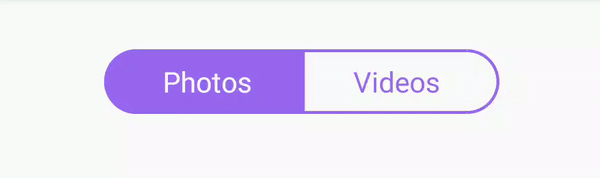

# FlipTabs
 
 [](https://opensource.org/licenses/MIT) [](https://jitpack.io/#Chrisvin/FlipTabs) [](https://android-arsenal.com/api?level=19)[](http://androidweekly.net/issues/issue-387)

<p align="center"></p>

FlipTabs is a lightweight library that contains a 2-tab view that switches using flip animation. ([Source of Inspiration](https://dribbble.com/shots/7419072-Segmented-Control))

## Getting started
### Setting up the dependency
1. Add the JitPack repository to your root build.gradle at the end of repositories:
```
allprojects {
	repositories {
		...
		maven { url 'https://jitpack.io' }
	}
}
```
2. Add the FlipTabs dependency in the build.gradle:
```
implementation 'com.github.Chrisvin:FlipTabs:v1.5'
```

### Demo app
To run the demo project, clone the repository and run it via Android Studio.
</br>(OR)
</br>Download the demo apk from [releases](https://github.com/Chrisvin/FlipTabs/releases).

## Usage
### Adding directly in layout.xml
```
<com.jem.fliptabs.FlipTab
  ...
  app:leftTabText="Photos"
  app:rightTabText="Videos"
  app:startingTab="right" //or "left"
  app:removeDefaultPadding="false" // `FlipTab` has a default padding of 16dp on all sides to ensure space for the flipping animation
  app:overallColor="#9966EE"
  app:textColor="#FF0000" //will be ignored if overallColor is defined
  app:highlightColor="#FF0000" //will be ignored if overallColor is defined
  app:borderWidth="4dp" // Default border width is 2dp
  app:flipAnimationDuration="400"
  app:wobbleReturnAnimationDuration="200"
  app:wobbleAngle="3" />
```
<b>Note:</b> Disabling the default padding (using `app:removeDefaultPadding="true"`) means that you (the dev) need to ensure that there is enough space around the FlipTab so as to not clip the flipping animation.
### Adding/Modifying programmatically
```kotlin
val flipTab = FlipTab(this)
flipTab.setLeftTabText("Photo")
flipTab.setRightTabText("Video")

//Sets color for both text, background & border
flipTab.setOverallColor(Color.BLUE)
//Sets color only bg & border
flipTab.setHighlightColor(Color.GREEN)
//Sets color only for text
flipTab.setTextColor(Color.GREEN)

//Time taken for selected tab to flip
flipTab.setFlipAnimationDuration(500)
//Time taken for tabs to revert to original state after wobble
flipTab.setWobbleReturnAnimationDuration(250)
//NOTE: totalAnimationDuration = flipAnimationDuration + wobbleReturnAnimationDuration

//Set angle upto which the tabs wobble
flipTab.setWobbleAngle(3f)
//Set width of the border in px
fliptab.setBorderWidth(12f)

//Modify properties of the textviews used in FlipTab
fliptab.getTextViews().forEach {
    it.setTypeface(it.typeface, Typeface.ITALIC)
}
//Or modify a specific textview
fliptab.getSelectedTextView().apply {
    setTypeface(typeface, Typeface.BOLD)
}
// Similarly, fliptab.getLeftTextView() & fliptab.getRightTextView() can be used

//Flip the tab (left -> right & vice versa)
flipTab.flipTabs()
//Selects the left tab (if left tab isn't already selected)
flipTab.selectLeftTab(withAnimation = true)
//Selects the right tab (if right tab isn't already selected)
flipTab.selectRightTab(withAnimation = false)
//(Does flip animation when selecting if withAnimation is true, else skips animation)

fliptab.setTabSelectedListener(object: FlipTab.TabSelectedListener {
    override fun onTabSelected(isLeftTab: Boolean, tabTextValue: String) {
        textSwitcher.setText(String.format(stringTemplate, tabTextValue))
        Toast.makeText(this@MainActivity, (if (isLeftTab) "Left" else "Right") + " tab selected", Toast.LENGTH_SHORT).show()
    }
    override fun onTabReselected(isLeftTab: Boolean, tabTextValue: String) {
        Toast.makeText(this@MainActivity, (if (isLeftTab) "Left" else "Right") + " tab reselected", Toast.LENGTH_SHORT).show()
    }
})
```

## Todo
- [ ] Current library overcomes view clipping by setting the parent layout's clipChildren & clipToPadding as false. Find a better alternative to overcome view clipping.
- [ ] Current library changes drawable and applies scaleX on the entire selected tab in the middle of the flip animation. Find a better alternative, such as applying scaleX only on the text instead of the whole view.
- [ ] Explore possibilities for multi tab design.

## Bugs and Feedback
For bugs, questions and discussions please use the [Github Issues](https://github.com/Chrisvin/FlipTabs/issues).

## License
```
MIT License

Copyright (c) 2019 Jem

Permission is hereby granted, free of charge, to any person obtaining a copy
of this software and associated documentation files (the "Software"), to deal
in the Software without restriction, including without limitation the rights
to use, copy, modify, merge, publish, distribute, sublicense, and/or sell
copies of the Software, and to permit persons to whom the Software is
furnished to do so, subject to the following conditions:

The above copyright notice and this permission notice shall be included in all
copies or substantial portions of the Software.

THE SOFTWARE IS PROVIDED "AS IS", WITHOUT WARRANTY OF ANY KIND, EXPRESS OR
IMPLIED, INCLUDING BUT NOT LIMITED TO THE WARRANTIES OF MERCHANTABILITY,
FITNESS FOR A PARTICULAR PURPOSE AND NONINFRINGEMENT. IN NO EVENT SHALL THE
AUTHORS OR COPYRIGHT HOLDERS BE LIABLE FOR ANY CLAIM, DAMAGES OR OTHER
LIABILITY, WHETHER IN AN ACTION OF CONTRACT, TORT OR OTHERWISE, ARISING FROM,
OUT OF OR IN CONNECTION WITH THE SOFTWARE OR THE USE OR OTHER DEALINGS IN THE
SOFTWARE.
```
